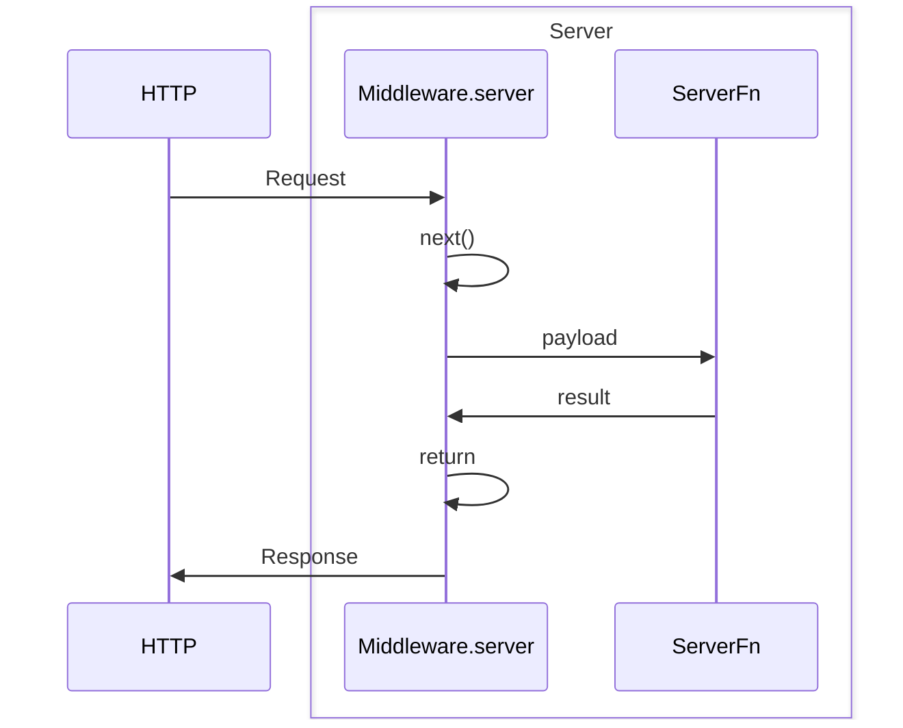
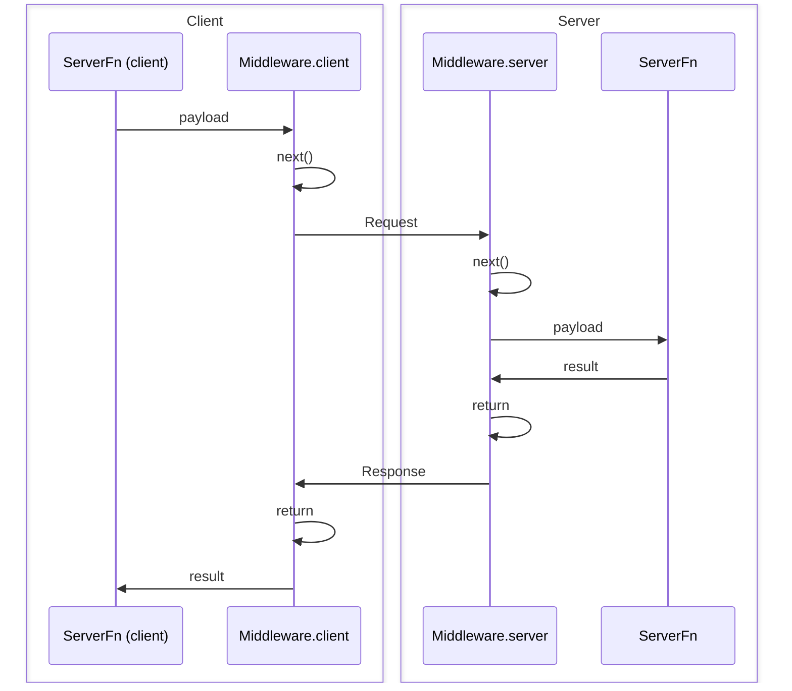

## O que e Middleware?

Middleware permite que voce personalize o comportamento tanto de server routes como GET/POST/etc (incluindo requisicoes para SSR da sua aplicacao) quanto de server functions criadas com `createServerFn`. Middleware e composivel e pode ate depender de outros middleware para criar uma cadeia de operacoes que sao executadas hierarquicamente e em ordem.

### Que tipos de coisas posso fazer com Middleware?

- **Autenticacao**: Verificar a identidade de um usuario antes de executar uma server function.
- **Autorizacao**: Verificar se um usuario tem as permissoes necessarias para executar uma server function.
- **Logging**: Registrar requisicoes, respostas e erros.
- **CSP**: Configurar Content Security Policy e outras medidas de seguranca.
- **Observabilidade**: Coletar metricas, traces e logs.
- **Fornecer Context**: Anexar dados ao objeto de requisicao para uso em outros middleware ou server functions.
- **Tratamento de Erros**: Tratar erros de forma consistente.
- E muito mais! As possibilidades dependem de voce!

## Tipos de Middleware

Existem dois tipos de middleware: **request middleware** e **server function middleware**.

- **Request middleware** e usado para personalizar o comportamento de qualquer requisicao do servidor que passe por ele, incluindo server functions.
- **Server function middleware** e usado para personalizar o comportamento de server functions especificamente.

> [!NOTE]
> Server function middleware e um subconjunto do request middleware que possui funcionalidades extras especificamente para server functions, como a capacidade de validar dados de entrada ou executar logica no lado do cliente tanto antes quanto depois da server function ser executada.

### Diferencas Principais

| Recurso            | Request Middleware                | Server Function Middleware |
| ------------------ | --------------------------------- | -------------------------- |
| Escopo             | Todas as requisicoes do servidor  | Apenas server functions    |
| Metodos            | `.server()`                       | `.client()`, `.server()`   |
| Validacao de Input | Nao                               | Sim (`.inputValidator()`)  |
| Logica no Cliente  | Nao                               | Sim                        |
| Dependencias       | Pode depender de request middleware | Pode depender de ambos   |

> [!NOTE]
> Request middleware nao pode depender de server function middleware, mas server function middleware pode depender de request middleware.

## Conceitos Principais

### Composicao de Middleware

Todo middleware e composivel, o que significa que um middleware pode depender de outro middleware.

```tsx
import { createMiddleware } from "@tanstack/react-start";

const loggingMiddleware = createMiddleware().server(() => {
  //...
});

const authMiddleware = createMiddleware()
  .middleware([loggingMiddleware])
  .server(() => {
    //...
  });
```

### Progredindo a Cadeia de Middleware

Middleware e "next-able", o que significa que voce deve chamar a funcao `next` no metodo `.server` (e/ou no metodo `.client` se voce estiver criando um server function middleware) para executar o proximo middleware na cadeia. Isso permite que voce:

- Interrompa a cadeia de middleware e retorne antecipadamente
- Passe dados para o proximo middleware
- Acesse o resultado do proximo middleware
- Passe context para o middleware que o envolve

```tsx
import { createMiddleware } from "@tanstack/react-start";

const loggingMiddleware = createMiddleware().server(async ({ next }) => {
  const result = await next(); // <-- This will execute the next middleware in the chain
  return result;
});
```

## Request Middleware

Request middleware e usado para personalizar o comportamento de qualquer requisicao do servidor que passe por ele, incluindo server routes, SSR e server functions.

Para criar um request middleware, chame a funcao `createMiddleware`. Voce pode chamar esta funcao com a propriedade `type` definida como 'request', mas esse e o valor padrao, entao voce pode omiti-la se preferir.

```tsx
import { createMiddleware } from "@tanstack/react-start";

const loggingMiddleware = createMiddleware().server(() => {
  //...
});
```

### Metodos Disponiveis

Request middleware possui os seguintes metodos:

- `middleware`: Adicionar um middleware a cadeia.
- `server`: Definir logica do lado do servidor que o middleware executara antes de qualquer middleware aninhado e, por fim, de uma server function, e tambem fornecer o resultado para o proximo middleware.

### O metodo `.server`

O metodo `.server` e usado para definir logica do lado do servidor que o middleware executara antes de qualquer middleware aninhado, e tambem fornecer o resultado para o proximo middleware. Ele recebe o metodo `next` e outras coisas como context e o objeto de requisicao:

```tsx
import { createMiddleware } from "@tanstack/react-start";

const loggingMiddleware = createMiddleware().server(
  ({ next, context, request }) => {
    return next();
  },
);
```

Para visualizar rapidamente essa interacao, aqui esta um diagrama:



### Usando Request Middleware com Server Routes

Voce pode usar request middleware com server routes de duas maneiras:

#### Todos os Metodos da Server Route

Para que uma server route use middleware para todos os metodos, passe um array de middleware para a propriedade `middleware` do objeto de construcao do metodo.

```tsx
import { createMiddleware } from "@tanstack/react-start";

const loggingMiddleware = createMiddleware().server(() => {
  //...
});

export const Route = createFileRoute("/foo")({
  server: {
    middleware: [loggingMiddleware],
    handlers: {
      GET: () => {
        //...
      },
      POST: () => {
        //...
      },
    },
  },
});
```

#### Metodos Especificos da Server Route

Voce pode passar middleware para metodos especificos da server route usando o utilitario `createHandlers` e passando um array de middleware para a propriedade `middleware` do objeto do metodo.

```tsx
import { createMiddleware } from "@tanstack/react-start";

const loggingMiddleware = createMiddleware().server(() => {
  //...
});

export const Route = createFileRoute("/foo")({
  server: {
    handlers: ({ createHandlers }) =>
      createHandlers({
        GET: {
          middleware: [loggingMiddleware],
          handler: () => {
            //...
          },
        },
      }),
  },
});
```

## Server Function Middleware

Server function middleware e um **subconjunto** do request middleware que possui funcionalidades extras especificamente para server functions, como a capacidade de validar dados de entrada ou executar logica no lado do cliente tanto antes quanto depois da server function ser executada.

Para criar um server function middleware, chame a funcao `createMiddleware` com a propriedade `type` definida como 'function'.

```tsx
import { createMiddleware } from "@tanstack/react-start";

const loggingMiddleware = createMiddleware({ type: "function" })
  .client(() => {
    //...
  })
  .server(() => {
    //...
  });
```

### Metodos Disponiveis

Server function middleware possui os seguintes metodos:

- `middleware`: Adicionar um middleware a cadeia.
- `inputValidator`: Modificar o objeto de dados antes de ser passado para este middleware, qualquer middleware aninhado e, eventualmente, a server function.
- `client`: Definir logica do lado do cliente que o middleware executara no cliente antes (e depois) da server function chamar o servidor para executar a funcao.
- `server`: Definir logica do lado do servidor que o middleware executara no servidor antes (e depois) da server function ser executada.

> [!NOTE]
> Se voce esta (esperamos que sim) usando TypeScript, a ordem desses metodos e imposta pelo sistema de tipos para garantir maxima inferencia e seguranca de tipos.

### O metodo `.client`

O metodo `.client` e usado para definir logica do lado do cliente que o middleware envolvera a execucao e o resultado da chamada RPC ao servidor.

```tsx
import { createMiddleware } from "@tanstack/react-start";

const loggingMiddleware = createMiddleware({ type: "function" }).client(
  async ({ next, context, request }) => {
    const result = await next(); // <-- This will execute the next middleware in the chain and eventually, the RPC to the server
    return result;
  },
);
```

### O metodo `.inputValidator`

O metodo `inputValidator` e usado para modificar o objeto de dados antes de ser passado para este middleware, middleware aninhados e, por fim, a server function. Este metodo deve receber uma funcao que pega o objeto de dados e retorna um objeto de dados validado (e opcionalmente modificado). E comum usar uma biblioteca de validacao como `zod` para isso.

```tsx
import { createMiddleware } from "@tanstack/react-start";
import { zodValidator } from "@tanstack/zod-adapter";
import { z } from "zod";

const mySchema = z.object({
  workspaceId: z.string(),
});

const workspaceMiddleware = createMiddleware({ type: "function" })
  .inputValidator(zodValidator(mySchema))
  .server(({ next, data }) => {
    console.log("Workspace ID:", data.workspaceId);
    return next();
  });
```

### Usando Server Function Middleware

Para que um middleware envolva uma server function especifica, voce pode passar um array de middleware para a propriedade `middleware` da funcao `createServerFn`.

```tsx
import { createServerFn } from "@tanstack/react-start";
import { loggingMiddleware } from "./middleware";

const fn = createServerFn()
  .middleware([loggingMiddleware])
  .handler(async () => {
    //...
  });
```

Para visualizar rapidamente essa interacao, aqui esta um diagrama:



## Gerenciamento de Context

### Fornecendo Context via `next`

A funcao `next` pode ser opcionalmente chamada com um objeto que possui uma propriedade `context` com um valor de objeto. Quaisquer propriedades que voce passar para esse valor `context` serao mescladas ao `context` pai e fornecidas ao proximo middleware.

```tsx
import { createMiddleware } from "@tanstack/react-start";

const awesomeMiddleware = createMiddleware({ type: "function" }).server(
  ({ next }) => {
    return next({
      context: {
        isAwesome: Math.random() > 0.5,
      },
    });
  },
);

const loggingMiddleware = createMiddleware({ type: "function" })
  .middleware([awesomeMiddleware])
  .server(async ({ next, context }) => {
    console.log("Is awesome?", context.isAwesome);
    return next();
  });
```

### Enviando Context do Cliente para o Servidor

**O context do cliente NAO e enviado para o servidor por padrao, pois isso poderia acabar enviando payloads grandes para o servidor de forma nao intencional.** Se voce precisa enviar context do cliente para o servidor, deve chamar a funcao `next` com uma propriedade `sendContext` e um objeto para transmitir quaisquer dados ao servidor. Quaisquer propriedades passadas para `sendContext` serao mescladas, serializadas e enviadas ao servidor junto com os dados e estarao disponiveis no objeto context normal de qualquer middleware do servidor aninhado.

```tsx
import { createMiddleware } from "@tanstack/react-start";

const requestLogger = createMiddleware({ type: "function" })
  .client(async ({ next, context }) => {
    return next({
      sendContext: {
        // Send the workspace ID to the server
        workspaceId: context.workspaceId,
      },
    });
  })
  .server(async ({ next, data, context }) => {
    // Woah! We have the workspace ID from the client!
    console.log("Workspace ID:", context.workspaceId);
    return next();
  });
```

#### Seguranca do Context Enviado pelo Cliente

Voce pode ter notado que no exemplo acima, embora o context enviado pelo cliente seja type-safe, ele nao e obrigado a ser validado em tempo de execucao. Se voce passa dados dinamicos gerados pelo usuario via context, isso pode representar uma preocupacao de seguranca, entao **se voce esta enviando dados dinamicos do cliente para o servidor via context, voce deve valida-los no middleware do lado do servidor antes de usa-los.**

```tsx
import { createMiddleware } from "@tanstack/react-start";
import { zodValidator } from "@tanstack/zod-adapter";
import { z } from "zod";

const requestLogger = createMiddleware({ type: "function" })
  .client(async ({ next, context }) => {
    return next({
      sendContext: {
        workspaceId: context.workspaceId,
      },
    });
  })
  .server(async ({ next, data, context }) => {
    // Validate the workspace ID before using it
    const workspaceId = zodValidator(z.number()).parse(context.workspaceId);
    console.log("Workspace ID:", workspaceId);
    return next();
  });
```

### Enviando Context do Servidor para o Cliente

Similar ao envio de context do cliente para o servidor, voce tambem pode enviar context do servidor para o cliente chamando a funcao `next` com uma propriedade `sendContext` e um objeto para transmitir quaisquer dados ao cliente. Quaisquer propriedades passadas para `sendContext` serao mescladas, serializadas e enviadas ao cliente junto com a resposta e estarao disponiveis no objeto context normal de qualquer middleware do cliente aninhado. O objeto retornado ao chamar `next` em `client` contem o context enviado do servidor para o cliente e e type-safe.

> [!WARNING]
> O tipo de retorno de `next` em `client` so pode ser inferido a partir de middleware conhecidos na cadeia de middleware atual. Portanto, o tipo de retorno mais preciso de `next` esta no middleware no final da cadeia de middleware.

```tsx
import { createMiddleware } from "@tanstack/react-start";

const serverTimer = createMiddleware({ type: "function" }).server(
  async ({ next }) => {
    return next({
      sendContext: {
        // Send the current time to the client
        timeFromServer: new Date(),
      },
    });
  },
);

const requestLogger = createMiddleware({ type: "function" })
  .middleware([serverTimer])
  .client(async ({ next }) => {
    const result = await next();
    // Woah! We have the time from the server!
    console.log("Time from the server:", result.context.timeFromServer);

    return result;
  });
```

## Middleware Global

Middleware global e executado automaticamente para cada requisicao na sua aplicacao. Isso e util para funcionalidades como autenticacao, logging e monitoramento que devem se aplicar a todas as requisicoes.

> [!NOTE]
> O arquivo `src/start.ts` nao esta incluido no template padrao do TanStack Start. Voce precisara criar este arquivo quando quiser configurar middleware global ou outras opcoes do Start.

### Middleware Global de Request

Para que um middleware seja executado para **cada requisicao tratada pelo Start**, crie um arquivo `src/start.ts` e use a funcao `createStart` para retornar sua configuracao de middleware:

```tsx
// src/start.ts
import { createStart, createMiddleware } from "@tanstack/react-start";

const myGlobalMiddleware = createMiddleware().server(() => {
  //...
});

export const startInstance = createStart(() => {
  return {
    requestMiddleware: [myGlobalMiddleware],
  };
});
```

> [!NOTE]
> Middleware global de **request** e executado antes de **cada requisicao, incluindo server routes, SSR e server functions**.

### Middleware Global de Server Function

Para que um middleware seja executado para **cada server function na sua aplicacao**, adicione-o ao array `functionMiddleware` no seu arquivo `src/start.ts`:

```tsx
// src/start.ts
import { createStart } from "@tanstack/react-start";
import { loggingMiddleware } from "./middleware";

export const startInstance = createStart(() => {
  return {
    functionMiddleware: [loggingMiddleware],
  };
});
```

### Ordem de Execucao do Middleware

Middleware e executado com dependencias primeiro, comecando pelo middleware global, seguido pelo middleware de server function. O exemplo a seguir registrara no log nesta ordem:

- `globalMiddleware1`
- `globalMiddleware2`
- `a`
- `b`
- `c`
- `d`
- `fn`

```tsx
import { createMiddleware, createServerFn } from "@tanstack/react-start";

const globalMiddleware1 = createMiddleware({ type: "function" }).server(
  async ({ next }) => {
    console.log("globalMiddleware1");
    return next();
  },
);

const globalMiddleware2 = createMiddleware({ type: "function" }).server(
  async ({ next }) => {
    console.log("globalMiddleware2");
    return next();
  },
);

const a = createMiddleware({ type: "function" }).server(async ({ next }) => {
  console.log("a");
  return next();
});

const b = createMiddleware({ type: "function" })
  .middleware([a])
  .server(async ({ next }) => {
    console.log("b");
    return next();
  });

const c = createMiddleware({ type: "function" })
  .middleware()
  .server(async ({ next }) => {
    console.log("c");
    return next();
  });

const d = createMiddleware({ type: "function" })
  .middleware([b, c])
  .server(async () => {
    console.log("d");
  });

const fn = createServerFn()
  .middleware([d])
  .server(async () => {
    console.log("fn");
  });
```

## Modificacao de Request e Response

### Lendo/Modificando a Resposta do Servidor

Middleware que usa o metodo `server` executa no mesmo contexto que server functions, entao voce pode seguir exatamente os mesmos [Utilitarios de Contexto de Server Function](./server-functions.md#server-function-context) para ler e modificar qualquer coisa sobre os headers da requisicao, codigos de status, etc.

### Modificando a Requisicao do Cliente

Middleware que usa o metodo `client` executa em um **contexto completamente diferente do lado do cliente** das server functions, entao voce nao pode usar os mesmos utilitarios para ler e modificar a requisicao. No entanto, voce ainda pode modificar a requisicao retornando propriedades adicionais ao chamar a funcao `next`.

#### Definindo Headers Personalizados

Voce pode adicionar headers a requisicao de saida passando um objeto `headers` para `next`:

```tsx
import { createMiddleware } from "@tanstack/react-start";
import { getToken } from "my-auth-library";

const authMiddleware = createMiddleware({ type: "function" }).client(
  async ({ next }) => {
    return next({
      headers: {
        Authorization: `Bearer ${getToken()}`,
      },
    });
  },
);
```

#### Mesclagem de Headers entre Middleware

Quando multiplos middleware definem headers, eles sao **mesclados**. Middleware posteriores podem adicionar novos headers ou sobrescrever headers definidos por middleware anteriores:

```tsx
import { createMiddleware } from "@tanstack/react-start";

const firstMiddleware = createMiddleware({ type: "function" }).client(
  async ({ next }) => {
    return next({
      headers: {
        "X-Request-ID": "12345",
        "X-Source": "first-middleware",
      },
    });
  },
);

const secondMiddleware = createMiddleware({ type: "function" }).client(
  async ({ next }) => {
    return next({
      headers: {
        "X-Timestamp": Date.now().toString(),
        "X-Source": "second-middleware", // Overrides first middleware
      },
    });
  },
);

// Final headers will include:
// - X-Request-ID: '12345' (from first)
// - X-Timestamp: '<timestamp>' (from second)
// - X-Source: 'second-middleware' (second overrides first)
```

Voce tambem pode definir headers diretamente no local da chamada:

```tsx
await myServerFn({
  data: { name: "John" },
  headers: {
    "X-Custom-Header": "call-site-value",
  },
});
```

**Precedencia de headers (todos os headers sao mesclados, valores posteriores sobrescrevem anteriores):**

1. Headers de middleware anteriores
2. Headers de middleware posteriores (sobrescrevem anteriores)
3. Headers do local da chamada (sobrescrevem todos os headers de middleware)

#### Implementacao de Fetch Personalizado

Para casos de uso avancados, voce pode fornecer uma implementacao personalizada de `fetch` para controlar como as requisicoes de server function sao feitas. Isso e util para:

- Adicionar interceptadores de requisicao ou logica de retry
- Usar um cliente HTTP personalizado
- Testes e mocking
- Adicionar telemetria ou monitoramento

**Via Middleware do Cliente:**

```tsx
import { createMiddleware } from "@tanstack/react-start";
import type { CustomFetch } from "@tanstack/react-start";

const customFetchMiddleware = createMiddleware({ type: "function" }).client(
  async ({ next }) => {
    const customFetch: CustomFetch = async (url, init) => {
      console.log("Request starting:", url);
      const start = Date.now();

      const response = await fetch(url, init);

      console.log("Request completed in", Date.now() - start, "ms");
      return response;
    };

    return next({ fetch: customFetch });
  },
);
```

**Diretamente no Local da Chamada:**

```tsx
import type { CustomFetch } from "@tanstack/react-start";

const myFetch: CustomFetch = async (url, init) => {
  // Add custom logic here
  return fetch(url, init);
};

await myServerFn({
  data: { name: "John" },
  fetch: myFetch,
});
```

#### Precedencia de Override do Fetch

Quando implementacoes personalizadas de fetch sao fornecidas em multiplos niveis, a seguinte precedencia se aplica (da prioridade mais alta para a mais baixa):

| Prioridade      | Origem             | Descricao                                            |
| --------------- | ------------------ | ---------------------------------------------------- |
| 1 (mais alta)   | Local da chamada   | `serverFn({ fetch: customFetch })`                   |
| 2               | Middleware posterior | Ultimo middleware na cadeia que fornece `fetch`      |
| 3               | Middleware anterior | Primeiro middleware na cadeia que fornece `fetch`    |
| 4               | createStart        | `createStart({ serverFns: { fetch: customFetch } })` |
| 5 (mais baixa)  | Padrao             | Funcao global `fetch`                                |

**Principio chave:** O local da chamada sempre vence. Isso permite que voce sobrescreva o comportamento do middleware para chamadas especificas quando necessario.

```tsx
import { createMiddleware, createServerFn } from "@tanstack/react-start";
import type { CustomFetch } from "@tanstack/react-start";

// Middleware sets a fetch that adds logging
const loggingMiddleware = createMiddleware({ type: "function" }).client(
  async ({ next }) => {
    const loggingFetch: CustomFetch = async (url, init) => {
      console.log("Middleware fetch:", url);
      return fetch(url, init);
    };
    return next({ fetch: loggingFetch });
  },
);

const myServerFn = createServerFn()
  .middleware([loggingMiddleware])
  .handler(async () => {
    return { message: "Hello" };
  });

// Uses middleware's loggingFetch
await myServerFn();

// Override with custom fetch for this specific call
const testFetch: CustomFetch = async (url, init) => {
  console.log("Test fetch:", url);
  return fetch(url, init);
};
await myServerFn({ fetch: testFetch }); // Uses testFetch, NOT loggingFetch
```

**Exemplo de Middleware Encadeado:**

Quando multiplos middleware fornecem fetch, o ultimo vence:

```tsx
import { createMiddleware, createServerFn } from "@tanstack/react-start";
import type { CustomFetch } from "@tanstack/react-start";

const firstMiddleware = createMiddleware({ type: "function" }).client(
  async ({ next }) => {
    const firstFetch: CustomFetch = (url, init) => {
      const headers = new Headers(init?.headers);
      headers.set("X-From", "first-middleware");
      return fetch(url, { ...init, headers });
    };
    return next({ fetch: firstFetch });
  },
);

const secondMiddleware = createMiddleware({ type: "function" }).client(
  async ({ next }) => {
    const secondFetch: CustomFetch = (url, init) => {
      const headers = new Headers(init?.headers);
      headers.set("X-From", "second-middleware");
      return fetch(url, { ...init, headers });
    };
    return next({ fetch: secondFetch });
  },
);

const myServerFn = createServerFn()
  .middleware([firstMiddleware, secondMiddleware])
  .handler(async () => {
    // Request will have X-From: 'second-middleware'
    // because secondMiddleware's fetch overrides firstMiddleware's fetch
    return { message: "Hello" };
  });
```

**Fetch Global via createStart:**

Voce pode definir um fetch personalizado padrao para todas as server functions na sua aplicacao fornecendo `serverFns.fetch` em `createStart`. Isso e util para adicionar interceptadores de requisicao globais, logica de retry ou telemetria:

```tsx
// src/start.ts
import { createStart } from "@tanstack/react-start";
import type { CustomFetch } from "@tanstack/react-start";

const globalFetch: CustomFetch = async (url, init) => {
  console.log("Global fetch:", url);
  // Add retry logic, telemetry, etc.
  return fetch(url, init);
};

export const startInstance = createStart(() => {
  return {
    serverFns: {
      fetch: globalFetch,
    },
  };
});
```

Esse fetch global tem prioridade menor que o fetch de middleware e do local da chamada, entao voce ainda pode sobrescreve-lo para server functions ou chamadas especificas quando necessario.

> [!NOTE]
> O fetch personalizado so se aplica no lado do cliente. Durante SSR, server functions sao chamadas diretamente sem passar pelo fetch.

## Ambiente e Performance

### Tree Shaking de Ambiente

A funcionalidade de middleware passa por tree-shaking com base no ambiente para cada bundle produzido.

- No servidor, nada sofre tree-shaking, entao todo o codigo usado em middleware sera incluido no bundle do servidor.
- No cliente, todo o codigo especifico do servidor e removido do bundle do cliente. Isso significa que qualquer codigo usado no metodo `server` e sempre removido do bundle do cliente. O codigo de validacao de `data` tambem sera removido.
